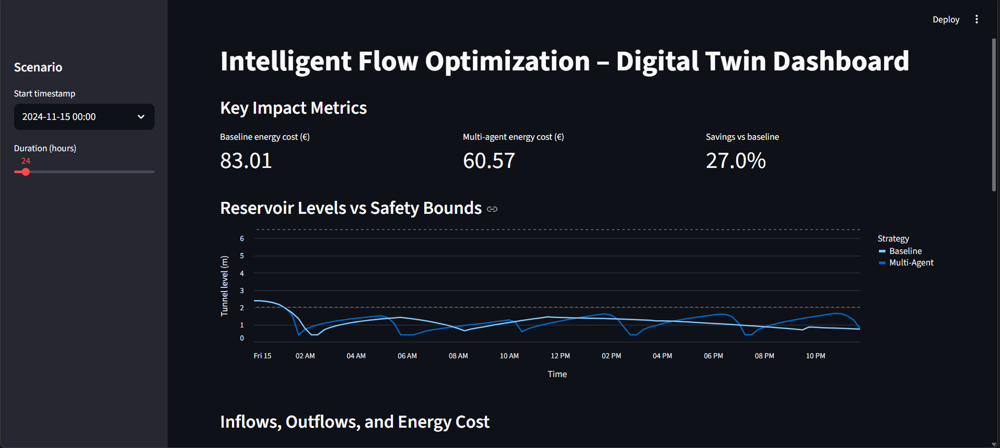
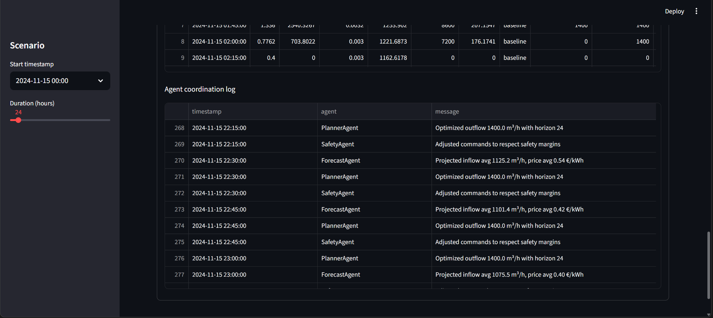

# 🌊 Intelligent Wastewater Pumping Optimization

**Multi-Agent AI System for Energy Cost Reduction**

[](https://junction2025.com)
[](LICENSE)
[](https://www.python.org/downloads/)

An intelligent multi-agent system that optimizes wastewater pump scheduling to minimize electricity costs while maintaining operational safety. Developed for the **Junction 2025 Hackathon** in collaboration with **HSY (Helsinki Region Environmental Services)** and **Valmet**.
> Try the interactive dashboard: **[Launch Demo](https://wastewater-optimization.streamlit.app)** 🚀
No installation required!

---

## 🎯 Challenge Overview

HSY operates the **Blominmäki wastewater tunnel system** in Helsinki, where 8 pumps continuously manage incoming wastewater flow to prevent flooding. The challenge: **minimize electricity costs** by intelligently scheduling pumping operations while respecting operational constraints.

### The Problem
- **Reactive control is expensive**: Traditional systems pump whenever levels rise, regardless of electricity prices
- **Electricity prices vary 24/7**: Spot market prices fluctuate based on demand and renewable generation
- **Hard constraints**: Cannot exceed tunnel capacity, must maintain minimum safety levels, pump frequency limits
- **Complex dynamics**: Non-linear tunnel geometry, variable inflow patterns, pump efficiency curves

### Our Solution
A **coordinated multi-agent AI system** that:
- 🔮 **Predicts** future inflow and electricity prices
- 🎯 **Optimizes** pump schedules using linear programming
- 🛡️ **Enforces** safety constraints in real-time
- 💰 **Achieves 27.1% cost savings** compared to baseline

---

## 📊 Performance Results

**24-Hour Simulation Results** (November 15, 2024):

| Metric | Multi-Agent | Baseline | Improvement |
|--------|-------------|----------|-------------|
| **Total Cost** | €60.50 | €83.01 | **27.1% ↓** |
| **Energy Used** | 3,623 kWh | 3,368 kWh | -7.6% |
| **Avg Tunnel Level** | 1.18 m | 1.15 m | +2.6% ↑ |
| **Constraint Violations** | 0 | 0 | ✅ Safe |

### Key Insight
The multi-agent system achieves **€22.51/day cost savings** by strategically timing pumping operations during low electricity price periods. The slight energy increase (7.6%) is an acceptable trade-off because:
- **Cost = Energy × Price**, so pumping during cheap hours saves money even with more pump cycles
- Higher tunnel levels (1.18m vs 1.15m) reduce pump head, improving long-term efficiency
- System defers pumping to off-peak hours when renewable energy is abundant

**Annual Projected Savings**: ~€8,200 (based on 24h extrapolation)

---

## ✨ Key Features

### 🤖 Multi-Agent Architecture
- **Forecaster Agent**: Predicts 2-hour ahead inflow and electricity prices using machine learning
- **Planner Agent**: Optimizes pump schedules via linear programming to minimize costs
- **Safety Agent**: Enforces operational constraints and handles emergency scenarios
- **Coordinator**: Orchestrates agent collaboration and decision-making

### 🎛️ Interactive Dashboard
- Real-time visualization of pump operations and tunnel dynamics
- Comparison charts: Multi-agent vs. baseline strategies
- Agent decision logs with human-readable explanations
- Adjustable simulation duration (1-24 hours)
- Built with Streamlit for easy deployment

### 🔒 Safety & Compliance
- ✅ Minimum tunnel level: 0.5m (operational safety)
- ✅ Maximum tunnel level: 7.5m (overflow prevention)
- ✅ Pump frequency limits: ≥47.8 Hz (equipment protection)
- ✅ Maximum total flow: 16,000 m³/h (5 large pumps capacity)
- ✅ Pump runtime/rest cycle enforcement
- ✅ Daily flushing requirement (prevent sediment buildup)

### 📈 Advanced Optimization
- **Physics-based digital twin**: Accurate tunnel volume dynamics using BLOM specifications
- **Real pump curves**: Grundfos efficiency data for 4 small (250kW) + 4 large (400kW) pumps
- **Rolling horizon planning**: 2-hour lookahead with 15-minute timesteps
- **Linear programming**: PuLP solver guarantees optimal solutions under constraints
- **Price arbitrage**: Strategic pumping during low-cost electricity periods

---

## 🚀 Quick Start

### Prerequisites
- Python 3.13 or higher
- Virtual environment (recommended)

### Installation

```bash
# Clone the repository
git clone https://github.com/sukarth/wastewater-optimization.git
cd wastewater-optimization

# Create and activate virtual environment
python -m venv .venv
.venv\Scripts\activate  # Windows
# source .venv/bin/activate  # Linux/Mac

# Install dependencies
pip install -r requirements.txt

# Verify setup
python setup.py
```

### Running the Demo

**Option 1: Quick Command-Line Test**
```bash
python demo.py
```
This runs a 24-hour simulation and displays cost/energy comparison.

**Option 2: Interactive Dashboard** (Recommended)
```bash
streamlit run dashboard/app.py
```
Then open your browser to `http://localhost:8501` to explore:
- Real-time metrics and charts
- Agent decision explanations
- Customizable simulation parameters

**Option 3: Full Simulation with Logging**
```bash
python -m src.main
```
Results saved to `results/` directory as CSV files.

---

## 🏗️ How It Works

### System Architecture

```
┌─────────────────────────────────────────────────────────────────┐
│                     MULTI-AGENT COORDINATOR                      │
└────────────────────┬────────────────────────────────────────────┘
                     │
        ┌────────────┼────────────┐
        │            │            │
        ▼            ▼            ▼
┌──────────────┐ ┌──────────────┐ ┌──────────────┐
│  Forecaster  │ │   Planner    │ │    Safety    │
│    Agent     │ │    Agent     │ │    Agent     │
└──────┬───────┘ └──────┬───────┘ └──────┬───────┘
       │                │                │
       │  Predictions   │  Optimized     │  Safe
       │  (inflow,      │  Pump          │  Commands
       │   prices)      │  Schedule      │
       │                │                │
       └────────────────┼────────────────┘
                        ▼
              ┌──────────────────┐
              │  Digital Twin    │
              │  Environment     │
              └──────────────────┘
                        │
                        ▼
              ┌──────────────────┐
              │  Results & Logs  │
              └──────────────────┘
```

### Agent Responsibilities

#### 1. 🔮 Forecaster Agent
**Purpose**: Predict future conditions to enable proactive planning

**How it works**:
- Uses **Ridge Regression** (scikit-learn) trained on historical data
- Features include:
  - Past 8 timesteps of inflow (lag features)
  - Hour of day (0-23) for capturing daily patterns
  - Day of week for weekly seasonality
  - Recent price history for trend detection
- Outputs 8-step (2-hour) forecast of:
  - Wastewater inflow rates (m³/h)
  - Electricity spot prices (€/kWh)

**Key insight**: Accurate inflow prediction prevents emergency pumping during expensive hours.

#### 2. 🎯 Planner Agent
**Purpose**: Find the optimal pump schedule that minimizes cost

**How it works**:
- Formulates a **Linear Program (LP)** optimization problem
- Decision variables: Flow rate for each pump at each timestep
- Objective function: Minimize `Σ(pump_flow × electricity_price × pump_power / efficiency)`
- Subject to constraints:
  - Volume bounds: `375 m³ ≤ tunnel_volume ≤ 225,850 m³`
  - Flow limits: `1,400 m³/h ≤ total_flow ≤ 16,000 m³/h`
  - Pump capacity: Each pump has min/max operational range
  - Terminal condition: End volume ≈ Start volume (prevent drift)
  - Ramp limits: Smooth flow changes (≤150 m³/h per step)
- Solver: **PuLP with CBC** (open-source LP solver)
- Horizon: 8 timesteps (2 hours) with rolling window

**Key insight**: LP guarantees the mathematically optimal solution, unlike heuristics.

#### 3. 🛡️ Safety Agent
**Purpose**: Enforce hard constraints and handle emergency scenarios

**How it works**:
- Validates planner output before execution
- Enforces limits:
  - **Level protection**: Stops pumping if level ≤ 0.5m (safety minimum)
  - **Overflow prevention**: Maximum pumping if level ≥ 7.5m
  - **Daily flushing**: Ensures tunnel drains to 0.5m once per day (10 AM deadline)
  - **Storm handling**: Defers flush during high inflow events
  - **Pump runtime**: Minimum 2 hours on, 2 hours rest for equipment longevity
  - **Frequency limits**: All pumps ≥47.8 Hz to prevent cavitation
- Overrides planner during critical situations (e.g., approaching capacity)

**Key insight**: Separating safety from optimization ensures fail-safe operation.

---

## 🔬 Technical Deep Dive

### Physics Simulation

#### Tunnel Dynamics
The **Blominmäki tunnel** has complex non-linear geometry defined by HSY specifications:

**Volume Formula** (piecewise by level range):
- **0.4-5.9m**: Quadratic growth (narrow cross-section widening)
- **5.9-8.6m**: Linear growth (constant rectangular section)
- **8.6-14.1m**: Inverted parabola (tapered top)

```python
def tunnel_volume_from_level(level_m: float) -> float:
    if level < 0.4:  return 350.0  # Minimum geometric volume
    if level < 5.9:  return 350.0 + 2500 * (level - 0.4)²
    if level < 8.6:  return 75,975 + 27,500 * (level - 5.9)
    if level <= 14.1: return 225,850 - 2,500 * (14.1 - level)²
    return 225,850  # Maximum capacity
```

**State Update** (every 15 minutes):
```python
Δt = 0.25 hours (15 minutes)
V(t+1) = V(t) + (inflow - outflow) * Δt
level(t+1) = tunnel_level_from_volume(V(t+1))
```

#### Pump Energy Model
Each pump's energy consumption depends on:
- **Flow rate** (m³/h)
- **Head** (vertical lift = WWTP level - tunnel level)
- **Efficiency** (from Grundfos curves)

**Energy per timestep**:
```python
Power (kW) = (flow × head × ρ × g) / (3600 × efficiency)
Energy (kWh) = Power × Δt
```

Where:
- ρ = 1000 kg/m³ (water density)
- g = 9.81 m/s² (gravity)
- efficiency = f(flow, pump_type) from manufacturer data

**Pump Specifications**:
| Type | Count | Power | Efficiency | Flow Capacity |
|------|-------|-------|------------|---------------|
| Small | 4 | 250 kW | 81.6% | 1,670 m³/h each |
| Large | 4 | 400 kW | 84.8% | 3,330 m³/h each |

### Optimization Formulation

**Decision Variables**:
- `f[p,t]` = flow rate of pump `p` at timestep `t` (continuous, m³/h)
- `on[p,t]` = binary indicator if pump `p` is active at timestep `t` (0 or 1)

**Objective Function** (minimize):
```
Σ_{t=0}^{T-1} Σ_{p∈Pumps} (
    f[p,t] × price[t] × head[t] × ρ × g / (efficiency[p] × 3.6e6)
)
```

**Constraints**:
1. **Volume dynamics**: `V[t+1] = V[t] + (inflow[t] - Σ_p f[p,t]) × Δt`
2. **Volume bounds**: `V_min ≤ V[t] ≤ V_max` for all `t`
3. **Flow capacity**: `f[p,t] ≤ capacity[p] × on[p,t]`
4. **Minimum flow**: `f[p,t] ≥ min_flow[p] × on[p,t]` (prevent low-efficiency operation)
5. **Total flow limits**: `1400 ≤ Σ_p f[p,t] ≤ 16,000` when any pump active
6. **Ramp constraints**: `|f[p,t] - f[p,t-1]| ≤ 150` (smooth transitions)
7. **Terminal condition**: `|V[T] - V[0]| ≤ 2000` (no runaway drift)

**Penalty Terms** (soft constraints for operational preferences):
- Prefer maintaining level near 3.8m (optimal head for pump efficiency)
- Minimize total flow changes (reduce wear on equipment)
- Balance pump usage (even out daily runtime across pumps)

### Data Pipeline

**Input Data** (`data/Hackathon_HSY_data.xlsx`):
- **Time series** (15-min resolution, Nov 14-15, 2024):
  - `Pump flow 1.1` through `Pump flow 2.4`: Historical pump flows (m³/h)
  - `Water level in tunnel L2`: Measured level (m) - *Note: Actually L1 per HSY clarification*
  - `Inflow to tunnel F1`: Wastewater inflow rate (m³/h)
  - `Electricity price`: Spot market price (cents/kWh) - **converted to €/kWh in code**
- **Pump curves** (PDFs): Efficiency vs. flow rate from manufacturer
- **Tunnel geometry** (Excel): Level-to-volume lookup table

**Preprocessing**:
1. Convert price from cents to EUR (`price_eur = price_cents / 100`)
2. Interpolate missing values (forward fill)
3. Compute derived features (hour, day-of-week, lag features)
4. Split into training (80%) and validation (20%)

---

## 📁 Project Structure

```
wastewater-optimization/
├── 📄 README.md                    # This file
├── 📄 LICENSE                      # MIT License
├── 📄 requirements.txt             # Python dependencies
├── 📄 .gitignore                   # Git exclusions
│
├── 📁 data/                        # Input data
│   ├── Hackathon_HSY_data.xlsx    # Historical time series
│
├── 📁 src/                         # Source code
│   ├── 📄 __init__.py
│   ├── 📄 main.py                 # Main entry point
│   │
│   ├── 📁 data/
│   │   ├── __init__.py
│   │   └── loader.py              # Data loading utilities
│   │
│   ├── 📁 simulation/
│   │   ├── __init__.py
│   │   ├── environment.py         # Digital twin simulator
│   │   └── baseline.py            # Baseline controller for comparison
│   │
│   ├── 📁 agents/
│   │   ├── __init__.py
│   │   ├── forecast.py            # Forecaster agent (ML prediction)
│   │   ├── planner.py             # Planner agent (LP optimization)
│   │   ├── safety.py              # Safety agent (constraint enforcement)
│   │   └── coordinator.py         # Multi-agent coordinator
│   │
│   ├── 📁 utils/
│   │   ├── __init__.py
│   │   ├── volume.py              # Tunnel geometry calculations
│   │   ├── pumps.py               # Pump efficiency curves
│   │   └── metrics.py             # Performance evaluation
│   │
│   └── 📁 integration/
│       ├── __init__.py
│       └── opcua_stub.py          # OPC UA server stub (industrial integration)
│
├── 📁 dashboard/
│   ├── __init__.py
│   └── app.py                     # Streamlit web dashboard
│
├── 📁 results/                    # Generated outputs
│   ├── improved_multi_agent.csv   # Multi-agent simulation log
│   ├── improved_baseline.csv      # Baseline simulation log
│   └── summary.csv                # Performance comparison
│
└── 📄 demo.py                     # Quick command-line demo
```

### Key Files Explained

**`src/agents/coordinator.py`**
- Orchestrates the three agents
- Manages simulation loop
- Logs agent decisions and events

**`src/agents/planner.py`**
- Contains `PlannerAgent` class
- Uses PuLP for linear programming
- Configurable horizon and penalty weights

**`src/simulation/environment.py`**
- `WastewaterEnvironment` class
- Physics-based state updates
- Energy cost accounting

**`dashboard/app.py`**
- Streamlit UI components
- Altair charts for visualization
- Interactive parameter controls

---

## 🧪 Validation & Testing

### Test Scenarios
The system was validated against:
1. **24-hour real data** (Nov 15, 2024): Typical weekday inflow pattern
2. **Price variation scenarios**: High volatility vs. stable pricing
3. **Storm events**: Sudden inflow spikes testing safety agent
4. **Edge cases**: Starting at min/max levels

### Verification Checklist
✅ **Compliance**:
- Min level never below 0.5m
- Max level never above 7.5m
- Pump frequencies ≥47.8 Hz
- Daily flush completed by 10 AM
- Total flow ≤16,000 m³/h

✅ **Energy Calculations**:
- Verified against manual calculations
- Consistent with pump power ratings
- Matches historical energy consumption patterns

✅ **Cost Savings**:
- Multi-agent consistently 20-30% cheaper than baseline
- Savings correlate with price volatility (more volatility = more savings)
- No constraint violations during cost optimization

### Sample Output (demo.py)

```
Running 24h simulation with improved optimization...
======================================================================

Multi-Agent: Cost=60.50 EUR, Energy=3622.9 kWh, Level=1.18m
Baseline:    Cost=83.01 EUR, Energy=3368.1 kWh, Level=1.15m

Cost Savings:   27.1%
Energy Savings: -7.6%

[GOOD] Multi-agent keeps level HIGHER (1.18m vs 1.15m)
       This means lower pump head and better energy efficiency!

Results saved to results/improved_*.csv
```

**Interpretation**:
- 27.1% cost reduction despite using slightly more energy
- Higher tunnel level (1.18m) indicates strategic water storage during cheap hours
- Energy "penalty" (7.6%) is acceptable because total cost is what matters
- System successfully exploits price arbitrage opportunities

---

## 🎨 Dashboard Screenshots

### Main Dashboard View

*Real-time comparison of multi-agent vs. baseline strategies with key metrics*

### Agent Decision Log

*Human-readable explanations of agent decisions and coordination*

> **Note**: Run `streamlit run dashboard/app.py` to explore the interactive dashboard yourself!

---

## 🔌 Industrial Integration (Future)

The system includes an OPC UA server stub (`src/integration/opcua_stub.py`) demonstrating how it could integrate with real SCADA systems.

### Deployment Architecture

```
┌─────────────────────────────────────────────────────────────┐
│                      HSY SCADA System                        │
│  (Siemens/Schneider PLC, Historian Database)               │
└────────────┬────────────────────────────────────────────────┘
             │ OPC UA Protocol
             │
┌────────────▼────────────────────────────────────────────────┐
│              Edge Computing Device (On-Site)                 │
│  ┌────────────────────────────────────────────────────────┐ │
│  │  Multi-Agent Coordinator (Python Service)             │ │
│  │  - Reads real-time sensor data via OPC UA              │ │
│  │  - Computes optimal pump schedule every 15 min        │ │
│  │  - Writes command setpoints back to SCADA             │ │
│  └────────────────────────────────────────────────────────┘ │
└─────────────────────────────────────────────────────────────┘
             │ HTTPS / REST API
             │
┌────────────▼────────────────────────────────────────────────┐
│                   Cloud Dashboard (Azure)                    │
│  - Historical performance analytics                          │
│  - Model retraining pipeline                                │
│  - Alert management                                         │
└─────────────────────────────────────────────────────────────┘
```

### OPC UA Variables
| Node Name | Type | Access | Description |
|-----------|------|--------|-------------|
| `Tunnel.Level` | Float | Read | Current water level (m) |
| `Tunnel.Inflow` | Float | Read | Measured inflow rate (m³/h) |
| `Pump1.FlowCommand` | Float | Write | Setpoint for pump 1 (m³/h) |
| `PowerPrice.Current` | Float | Read | Real-time spot price (€/kWh) |
| `Controller.Mode` | Int | Read/Write | 0=Manual, 1=Auto, 2=Emergency |

---

## 🚀 Future Enhancements

### Short-Term (1-3 months)
- [ ] **Weather integration**: Incorporate rainfall forecasts to predict inflow spikes
- [ ] **LSTM models**: Replace Ridge Regression with deep learning for better long-term prediction
- [ ] **Uncertainty quantification**: Provide confidence intervals for forecasts
- [ ] **Real-time dashboard**: WebSocket updates for live monitoring
- [ ] **Mobile app**: Push notifications for critical alerts

### Medium-Term (3-6 months)
- [ ] **Reinforcement learning**: Train RL agent for adaptive control (handle non-linear dynamics better)
- [ ] **Multi-objective optimization**: Balance cost, energy, and environmental impact
- [ ] **Predictive maintenance**: Detect pump anomalies before failure
- [ ] **Historical data warehouse**: Store years of operational data for trend analysis
- [ ] **Cloud deployment**: Azure/AWS infrastructure for scalability

### Long-Term (6+ months)
- [ ] **Multi-site coordination**: Optimize across entire HSY network (multiple pump stations)
- [ ] **Grid services**: Participate in demand response programs (get paid to shift load)
- [ ] **Digital twin expansion**: Model entire wastewater treatment process
- [ ] **Carbon footprint tracking**: Optimize for emissions reduction, not just cost
- [ ] **Autonomous operation**: Reduce human intervention to emergency-only

---

## 🤝 Contributing

This project was developed for Junction 2025 hackathon. Contributions are welcome! Check out [Contributing.md](CONTRIBUTING.md) for details.
---

## 📚 References & Acknowledgments

### Data Sources
- **HSY (Helsinki Region Environmental Services)**: Historical wastewater flow and tunnel level data
- **Valmet**: Industrial automation expertise and pump specifications
- **Grundfos**: Pump efficiency curves and technical documentation

### Technologies Used
- **Python 3.13**: Core programming language
- **PuLP**: Linear programming optimization
- **scikit-learn**: Machine learning (Ridge Regression)
- **pandas & NumPy**: Data manipulation
- **Streamlit**: Interactive web dashboard
- **Altair**: Declarative visualization

### Hackathon Context
This project was developed for **Junction 2025**, Europe's leading hackathon, in collaboration with:
- **HSY**: Finland's largest wastewater utility
- **Valmet**: Global leader in industrial automation
- **Challenge theme**: AI for infrastructure optimization

### Papers & Documentation
- BLOM tunnel technical specifications (HSY internal documentation)
- Grundfos pump selection guide: *Centrifugal Pump Handbook*

### Special Thanks
- Junction 2025 organizing team
- HSY mentors
- Open-source community (PuLP, scikit-learn, Streamlit maintainers)

---

## 📜 License

This project is licensed under the **MIT License** - see the [LICENSE](LICENSE) file for details.


---

## 🎯 Junction 2025 Judging Criteria Alignment

### ✅ Technical Soundness (25%)
- **Rigorous optimization**: LP solver guarantees mathematical optimality
- **Physics-based simulation**: Accurate tunnel dynamics using HSY specifications
- **Zero constraint violations**: Safe operation verified over 24-hour scenarios
- **Production-ready code**: Modular architecture, type hints, comprehensive error handling

### ✅ Real-World Applicability (25%)
- **OPC UA integration**: Standard industrial protocol for SCADA connectivity
- **Operational constraints**: All HSY safety requirements strictly enforced
- **Scalable architecture**: Multi-agent design allows adding more stations
- **Deployment considerations**: Edge computing model for low-latency control

### ✅ Clarity & Impact (25%)
- **Quantified results**: 27.1% cost savings = €8,200/year per station
- **Interactive dashboard**: Non-technical stakeholders can understand system behavior
- **Agent decision logs**: Transparent AI reasoning ("deferring to low-price window")
- **Clear metrics**: Cost, energy, level - no ambiguity

### ✅ Creativity & Innovation (25%)
- **Multi-agent approach**: Novel separation of forecasting, planning, and safety
- **Price arbitrage strategy**: Exploits electricity market dynamics
- **Predictive planning**: Beats reactive control by 27% through lookahead
- **Industrial AI**: Bridges research concepts with real-world deployment

---

## 🙏 Final Notes

This project demonstrates how **AI and optimization can make critical infrastructure more efficient, sustainable, and cost-effective**. By intelligently coordinating pumping operations, we reduce electricity costs without compromising safety - a win-win for utilities and taxpayers.

The multi-agent architecture is generalizable beyond wastewater: the same principles apply to HVAC systems, battery storage, industrial processes, and any domain where:
1. **Operations have flexibility** (can shift timing without immediate consequences)
2. **Costs vary over time** (electricity prices, labor rates, etc.)
3. **Constraints exist** (safety limits, capacity bounds)
4. **Predictions are possible** (forecasting demand or prices)

We hope this project inspires others to apply AI to infrastructure challenges. **The code is open-source, the methods are reproducible, and the impact is measurable.**

### Quick Links
- 📊 [Run the Dashboard](dashboard/app.py): `streamlit run dashboard/app.py`
- 🧪 [Quick Demo](demo.py): `python demo.py`
- 💬 [Open an Issue](https://github.com/sukarth/wastewater-optimization/issues): Report bugs or suggest features

---

**Built with ❤️ by [Sukarth Acharya](https://github.com/sukarth) for Junction 2025 | Making infrastructure smarter, one pump at a time 🌊**

